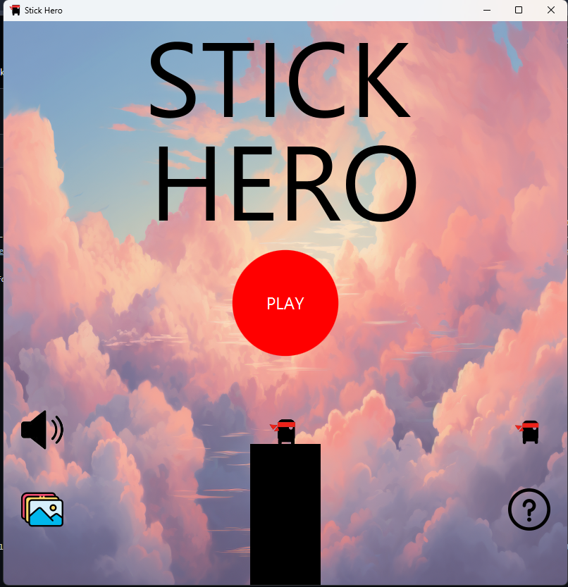
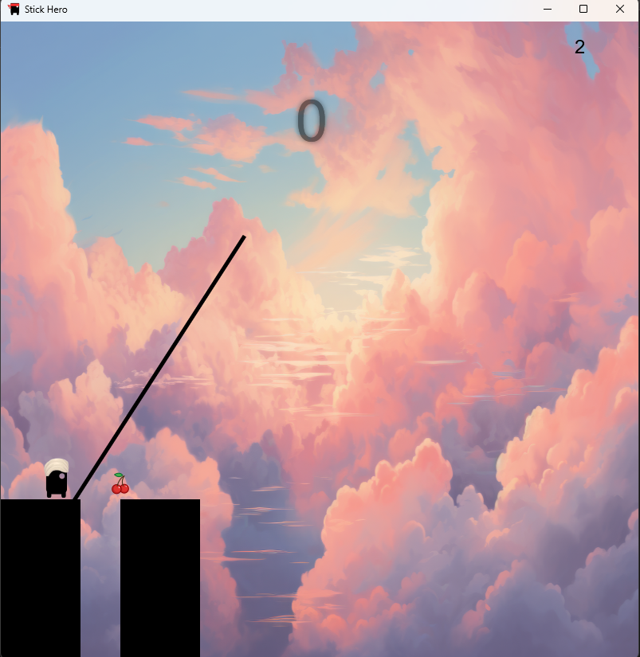
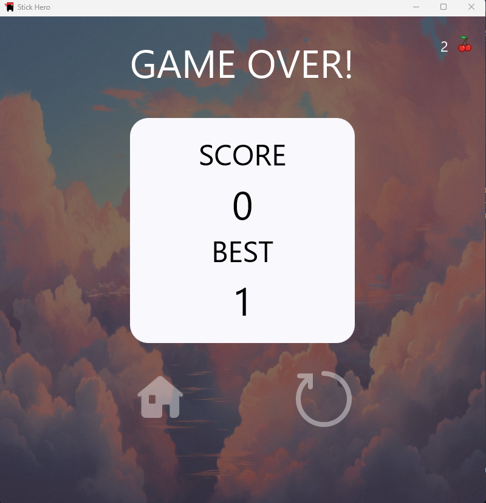
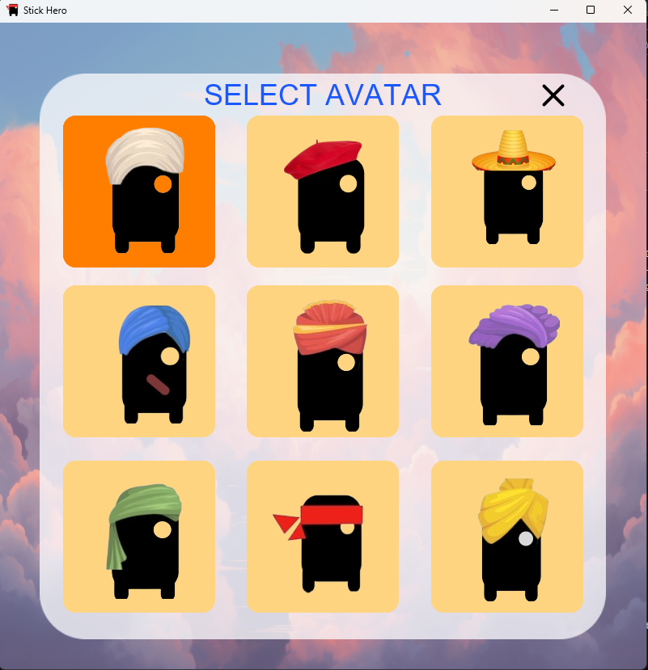
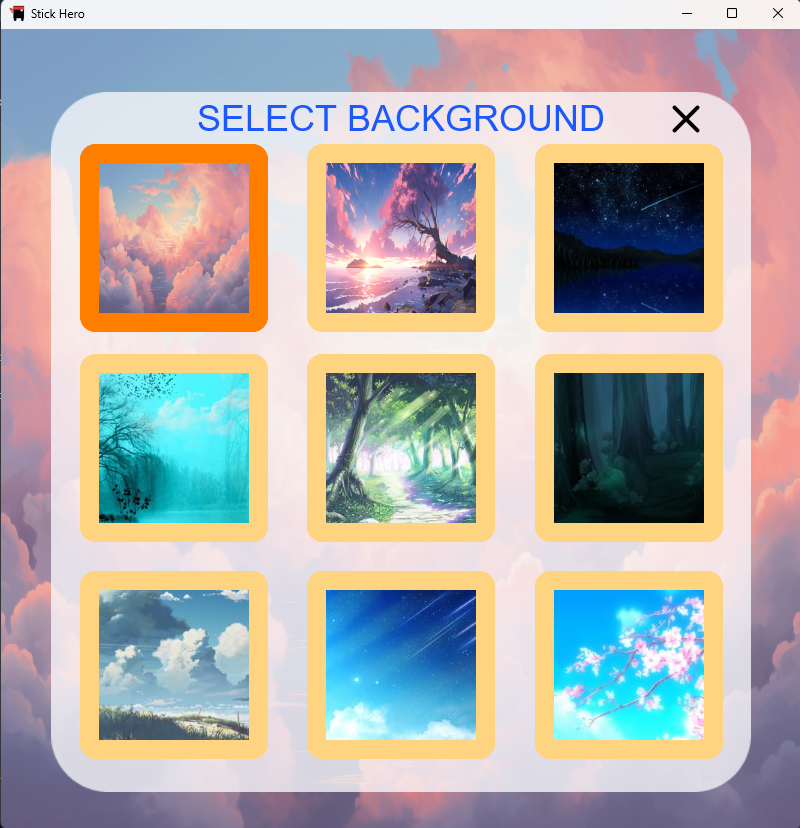

# 🎮 Stick Hero — JavaFX Game

## 🕹️ Introduction

**Stick Hero** is a fun and addictive JavaFX game that tests your timing and reflexes. Grow the stick just right to help your hero cross from one platform to another — too short or too long, and you fall! Designed with clean architecture and popular design patterns (Singleton, Flyweight), this game offers both a great user experience and well-structured code for learners and contributors.

---

## 📽️ Demo Video

🎬 **Watch the Game in Action:**

[](https://youtu.be/xhWDfI03awE)

🔗 [Click here to view the demo on YouTube](https://youtu.be/xhWDfI03awE)

---


## 📸 Screenshots

| Main Menu                               | Gameplay                              | Game Over                               | Avatar Selection                                      | Background Gallery                                        |
| --------------------------------------- | ------------------------------------- | --------------------------------------- | ----------------------------------------------------- | --------------------------------------------------------- |
|  |  |  |  |  |

> 📁 **Note:** Ensure the screenshots are located in a `screenshots/` folder within your repository.

---

## 📚 Table of Contents

* [Game Overview](#-game-overview)
* [Screens & Controllers](#-screens--controllers)
* [Core Game Logic](#-core-game-logic)
* [Game Features](#-game-features)
* [Getting Started](#-getting-started)
* [Contributing](#-contributing)
* [GitHub Repository](#-github-repository)
* [Acknowledgments](#-acknowledgments)

---

## 🧩 Game Overview

In **Stick Hero**, players tap and hold to grow a stick and release to let it fall across a gap between platforms. If it lands correctly, the hero walks across and the game continues. If not, it’s game over!

### Highlights:

* Clean JavaFX architecture
* Avatar & background customization
* Use of key design patterns (Flyweight, Singleton)
* Sound effects for immersion

---

## 🎮 Screens & Controllers

### ✅ HelloController

Manages the **main menu** with options to start the game, view help, or exit.

### ✅ GameController

Handles all **gameplay logic**, stick growth, collisions, transitions, and animations.

### ✅ GameOverScreenController

Shows final **score**, and offers options to **restart** or **go to main menu**.

### ✅ HelpScreenController

Displays **instructions** and **tips** to play the game effectively.

### ✅ AvatarController (Flyweight Pattern)

Efficiently loads and reuses avatar images using the **Flyweight design pattern**.

### ✅ GalleryScreenController

Lets players **customize background themes** by selecting images from a **gallery**.

---

## 🧠 Core Game Logic

### 🔁 StickHeroGame

Core class managing:

* Platform generation
* Stick creation and rotation
* Hero movement
* Score updates
* State transitions

### 🪵 StickCreate (Runnable)

A separate thread for stick growth animation, ensuring smooth rendering while keeping UI responsive.

---

## 🔊 Game Features

### 🔈 Sound Management

Plays sound effects for:

* Stick drop
* Hero movement
* Game over events

### 🧍 Hero (Singleton Pattern)

Implements the **Singleton pattern** to ensure a single instance of the hero. Manages:

* Character state
* Position tracking
* Movement animations

---

## 🚀 Getting Started

### 📦 Prerequisites

* Java JDK 8 or later
* JavaFX SDK (if not bundled with JDK)
* Maven (optional)

### ▶️ Run the Game

1. **Clone the repo**:

   ```bash
   git clone https://github.com/namit22315/STICKHERO.git
   cd STICKHERO
   ```

2. **Run with Maven**:

   ```bash
   mvn clean
   mvn javafx:run
   ```

3. **Or open in an IDE** (IntelliJ, Eclipse):

   * Import project
   * Set JavaFX VM options if needed
   * Run the main class

---

## 🤝 Contributing

### 🧑‍💻 Developed by: **Namit Jain**

**Contributions:**

* JavaFX UI Design (Menus, Help, Gallery, Game Over)
* Avatar & Background Customization
* Core Game Logic (Stick, Hero, Gameplay)
* Sound Effects Integration
* Singleton & Flyweight Design Patterns

---

## 🔗 GitHub Repository

🔍 Explore the codebase, raise issues, and contribute:
[https://github.com/namit22315/STICKHERO.git](https://github.com/Namitjain07/STICKHERO.git)

---

## 🙏 Acknowledgments

* **JavaFX** — for the smooth GUI framework.
* **JUnit** — for testing inspiration.
* **YouTube tutorials & GitHub communities** — for early game dev guidance.

---
